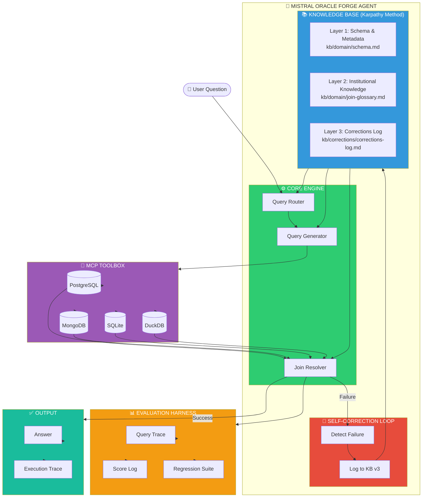

# 🔮 Mistral Oracle Forge

## Production Data Analytics Agent for Multi-Database Workloads
 Production-grade data analytics agent for multi-database workloads. Team Mistral submission for The Oracle Forge challenge
## What This Agent Does

This agent answers complex business questions across **multiple databases** — PostgreSQL, MongoDB, SQLite, DuckDB — something most AI agents cannot do reliably.

**Example capability:**
> *"Which customer segments had declining repeat purchase rates in Q3, and does that pattern correlate with support ticket volume in our CRM?"*

The agent navigates transaction DB + CRM DB, resolves inconsistent customer IDs, extracts structured data from unstructured notes, and produces a verifiable answer.

---

## Architecture


---

## Three Context Layers

| Layer | What It Contains | Where |
|-------|-----------------|-------|
| **Layer 1** | Schema & metadata from all databases | `kb/domain/schema.md` |
| **Layer 2** | Institutional knowledge (what "revenue" means, authoritative tables) | `kb/domain/` |
| **Layer 3** | Interaction memory (past corrections, successful patterns) | `kb/corrections/` |

---

## Project Structure
```bash
mistral-oracle-forge/
│
├── agent/ # Core agent code
│ ├── AGENT.md # Context file (loaded at session start)
│ ├── tools.yaml # MCP database connections
│ ├── main.py # Entry point
│ ├── query_router.py # Routes to correct database
│ ├── db_connector.py # Database connections
│ ├── join_resolver.py # Fixes format mismatches
│ └── requirements.txt # Python dependencies
│
├── kb/ # Knowledge Base (Karpathy method)
│ ├── architecture/ # Claude Code, OpenAI patterns
│ ├── domain/ # Schema, join keys, unstructured fields
│ ├── evaluation/ # DAB format, scoring
│ └── corrections/ # Self-learning log
│
├── eval/ # Evaluation harness
│ ├── harness.py # Main evaluation script
│ ├── score_log.md # Score improvement tracking
│ ├── regression_suite.py # Regression tests
│ └── held_out_queries.json # Test set
│
├── probes/ # Adversarial probes
│ └── probes.md # 15+ probes, 4 failure categories
│
├── planning/ # AI-DLC documentation
│ ├── inception.md # Press release, FAQ, definition of done
│ ├── approvals.md # Team gate approvals
│ └── mob-session-log.md # Daily mob session records
│
├── utils/ # Shared utilities
│ ├── retrieval_helper.py # Multi-pass retrieval
│ ├── schema_introspector.py # Schema discovery
│ ├── benchmark_wrapper.py # DAB benchmark runner
│ └── README.md
│
├── signal/ # Signal Corps outputs
│ ├── engagement_log.md # All posts and metrics
│ └── community_log.md # Reddit/Discord/X interactions
│
├── results/ # Benchmark results
│ └── (DAB results JSON)
│
├── scripts/ # Automation scripts
│ └── setup.sh # One-command setup
│
├── .github/workflows/ # CI/CD
│ └── ci.yml # Minimal CI
│
├── README.md # This file
├── .gitignore
├── .env.example
└── docker-compose.yml

```

---

## Quick Start

### Prerequisites

- Python 3.10+
- Docker (optional, for sandbox)
- Tailscale (for team server access)

### One-Command Setup

```bash
# Clone and setup
git clone https://github.com/TsegayIS122123/mistral-oracle-forge
cd mistral-oracle-forge
chmod +x scripts/setup.sh
./scripts/setup.sh